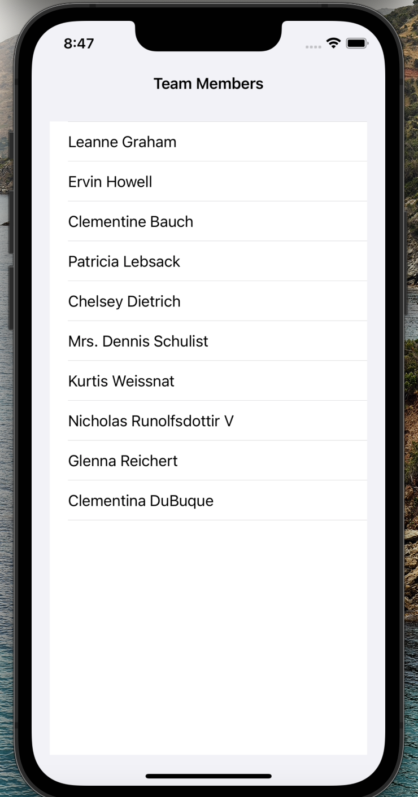
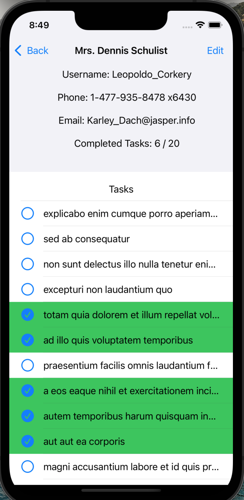
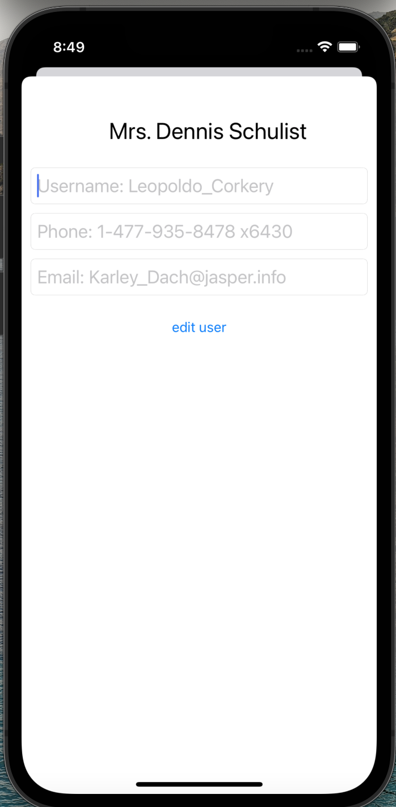
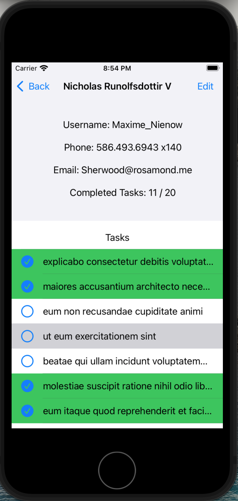

# Team Tasks

---

## Overview
Team Tasks uses JSONplaceholder, a free fake API. Both decoding functions are in Decode.swift. The User and Task model both are codable, and have variables reflected by the API.
### first screen
The application opens up with a UITableView of all the Users' names, configured in the UserTableViewCell class. 
### second screen
Selecting a user name shows the user's username, phone, email and number of completed tasks in UILabels. Below that is a UITableView of all the user's tasks, configured in the TaskTableViewCell class. Each task has an icon showing if it was completed or not. Completed tasks also has an animatation that turns the cell green as the cell becomes visible, to further highlight the satisfaction of a completed task. 
## edit screen
Each user screen also has an edit button on the right of the navigation bar. At the top are UITextFields for username, phone and email, which are saved by pushing return. Style for the UITextFields are in the UserTextField.swift. There are no user validations currently for the textfields. Clicking the "edit user" button sends a PUT request to the API, however since the server won't reflect these changes, the json of the returned User object is printed. 

---
## Design pattern
This application was written using **UIKit programmatically** and follows the **MVC pattern**. This is organized with separate folder for each component. All ViewControllers are in the Controller folder, the custom UIViews (table header, table cells) in the View, and the Model with the Task and User models and the API call functions.

---
### Screenshots (shown on iphone 13 Pro)
&#8595; **User View/ first screen**

Table View of all users, displaying the name

&#8595; **User Task View/ second screen**

User info in labels at the top and Table View of all Tasks at the bottom
Completed Tasks with checkmark.circle icon and the green cell color from the animation, which turns completed task cells green when scrolled into view.

&#8595; **User Edit View**

TextFields and edit button on a modal screen

&#8595; **Example of User Task View on iphone SE**

Showing the busiest view on the smallest iphone screen

